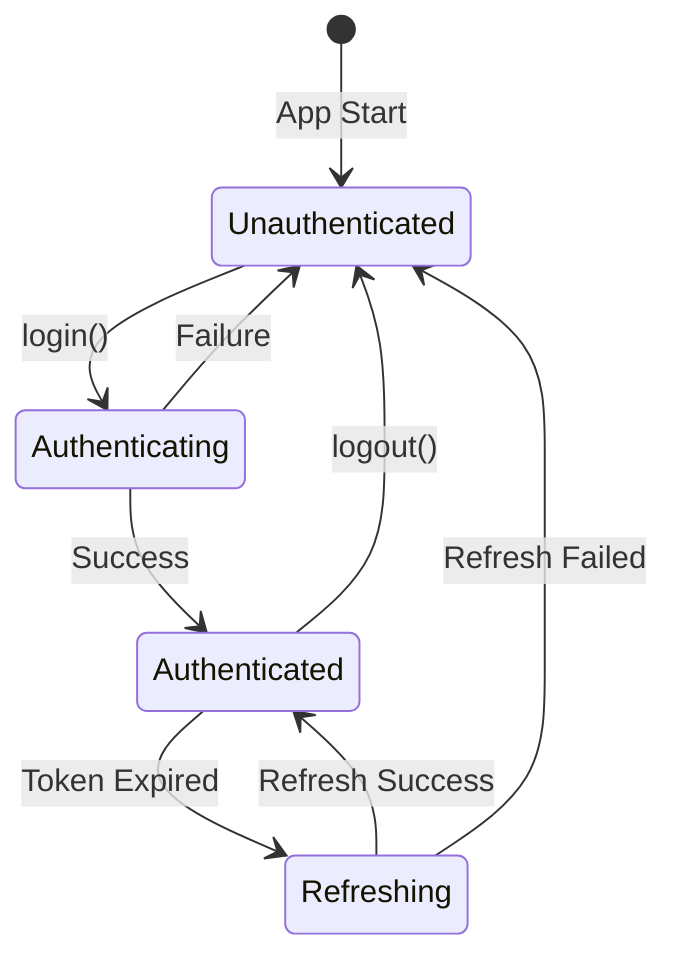

# Data Model: Keycloak Authentication

**Feature**: 003-keycloak-auth  
**Date**: 2025-12-21

## Entities

### AuthState

Represents the current authentication state in the application.

| Field             | Type             | Description                             |
| ----------------- | ---------------- | --------------------------------------- |
| `isAuthenticated` | `boolean`        | Whether user is currently authenticated |
| `isLoading`       | `boolean`        | Whether auth operation is in progress   |
| `user`            | `User \| null`   | Current authenticated user              |
| `error`           | `string \| null` | Last authentication error               |

### User

Represents an authenticated user extracted from JWT token claims.

| Field       | Type                  | Description            | Source Claim         |
| ----------- | --------------------- | ---------------------- | -------------------- |
| `id`        | `string`              | Unique user identifier | `sub`                |
| `username`  | `string`              | User's login name      | `preferred_username` |
| `email`     | `string`              | User's email address   | `email`              |
| `firstName` | `string \| undefined` | User's first name      | `given_name`         |
| `lastName`  | `string \| undefined` | User's last name       | `family_name`        |
| `roles`     | `string[]`            | Assigned realm roles   | `realm_access.roles` |

### TokenResponse

Response from Keycloak token endpoint.

| Field                | Type     | Description                       |
| -------------------- | -------- | --------------------------------- |
| `access_token`       | `string` | JWT access token                  |
| `refresh_token`      | `string` | JWT refresh token                 |
| `expires_in`         | `number` | Access token validity in seconds  |
| `refresh_expires_in` | `number` | Refresh token validity in seconds |
| `token_type`         | `string` | Token type (always "Bearer")      |

### LoginCredentials

User credentials for password grant login.

| Field      | Type     | Description                |
| ---------- | -------- | -------------------------- |
| `username` | `string` | User's login name or email |
| `password` | `string` | User's password            |

### KeycloakConfig

Configuration for Keycloak connection.

| Field      | Type     | Description         | Env Variable              |
| ---------- | -------- | ------------------- | ------------------------- |
| `url`      | `string` | Keycloak server URL | `VITE_KEYCLOAK_URL`       |
| `realm`    | `string` | Keycloak realm name | `VITE_KEYCLOAK_REALM`     |
| `clientId` | `string` | OAuth2 client ID    | `VITE_KEYCLOAK_CLIENT_ID` |

## State Transitions

## Validation Rules

### LoginCredentials

- `username`: Required, 1-255 characters
- `password`: Required, 1-255 characters

### Token Claims

- `sub`: Required, non-empty string
- `preferred_username`: Required, non-empty string
- `exp`: Required, valid Unix timestamp in the future
- `realm_access.roles`: Optional, defaults to empty array

## Storage Schema (localStorage)

| Key             | Type     | Description                        |
| --------------- | -------- | ---------------------------------- |
| `access_token`  | `string` | Current access token               |
| `refresh_token` | `string` | Current refresh token              |
| `token_expiry`  | `number` | Access token expiry timestamp (ms) |
